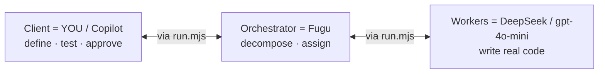
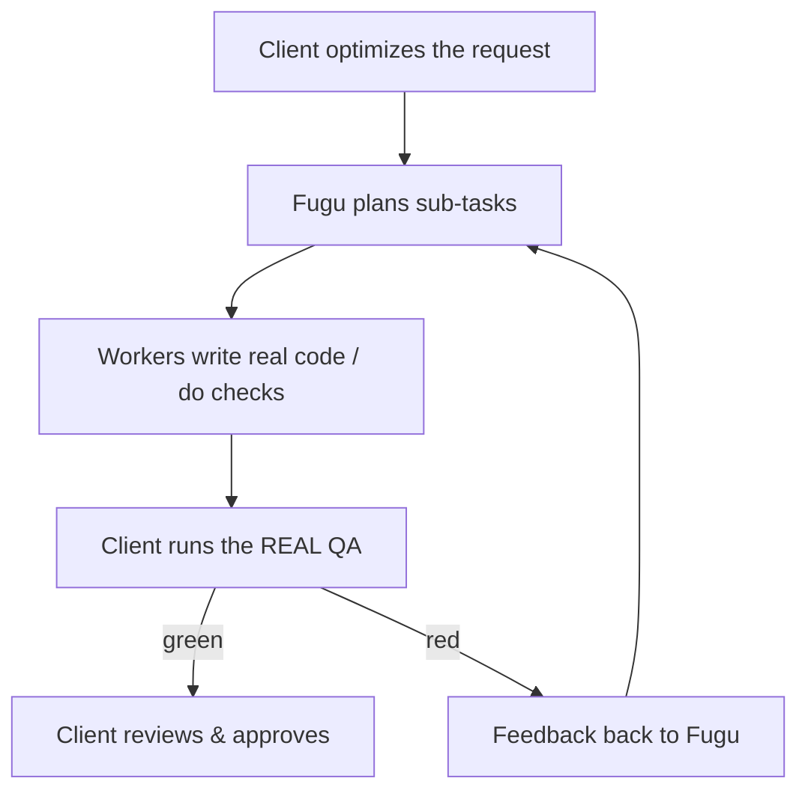

# Agent Pipeline — Guide

A plain-language guide to the multi-agent delivery pipeline: **how it works** (Part 1)
and a **FAQ** (Part 2) built from real questions people have asked.

For commands and setup steps, see [README.md](./README.md). This document explains
the *idea*.

---

## Part 1 — The whole idea

### The problem it solves

You want work done by AI the way a real software team does it: someone owns the
request, a lead breaks it down, developers build it, and the owner tests the real
result and asks for fixes until it's right. This pipeline wires up exactly that
loop using three different AI models, each playing a role it's good at.

### The three actors (and one piece of wiring)

| Role | Who | What they do |
|------|-----|--------------|
| **Client** | You / Copilot (any model — Opus 4.8, GPT‑5.5, …) | Define the work, optimize the request, **test the real output**, approve or reject. The only approver. |
| **Orchestrator** | Fugu (Sakana) | The chief engineer. Breaks the request into bounded sub‑tasks and assigns each to the best worker. |
| **Workers** | DeepSeek‑4‑pro, gpt‑4o‑mini | The developers. They write real code directly into the repo. |

There is also one thing that is **not** an actor: the **wiring** — the small
command‑line program [`run.mjs`](./run.mjs). The three actors are AI models behind
web APIs; they cannot call each other. `run.mjs` is the phone line between them: it
sends your request to Fugu, reads Fugu's plan, sends each sub‑task to the right
worker, writes the workers' files, runs your tests, and carries results back to
Fugu. It carries messages — it does **not** make decisions. All the thinking
belongs to the actors.

### How it develops: no sandbox

Workers develop **straight into the real repository** — the actual `apps/`,
`services/`, etc. There is no staging folder and no "build somewhere else, then
move it in." You then test the real, live result (typecheck, Playwright against the
running stack, `curl` against real endpoints). This mirrors how a real team ships:
developers push to the real project, and the client tests the real project.

The only things that ever land in the `agent-output/` folder are **plans, feedback,
and raw dumps** — never product code.

### The loop

The loop is bounded (a `maxRounds` guard) so it can't run forever. On each failure
the real test output is fed back to Fugu, which produces a **minimal fix plan**;
workers fix it in place; the client tests again.

### Two kinds of sub-task

Not all work writes code. Fugu tags each sub‑task:

- **`build`** — the worker writes/edits files (implementation work).
- **`verify`** — a check only (health, smoke, "does it run?"). No code is written;
  the client's real QA confirms it.

The wiring follows Fugu's tag. It never forces a check to produce code, and it
never crashes just because a worker had nothing to write — it reports back to Fugu
and the loop continues.

### Running in parallel (Fugu coordinates, containers execute)

Coordination — what runs, in what order, what can go at the same time — is an
orchestration decision, so it belongs to **Fugu**, not the wiring. Fugu expresses
it in the plan with **`dependsOn`**: each sub‑task lists the ids that must finish
first. Sub‑tasks with no unmet dependency run **in parallel**.

The wiring is just Fugu's hands: it executes that graph, running independent
sub‑tasks concurrently up to `loop.concurrency`. When `container.enabled` is set,
each build sub‑task runs in its **own ephemeral Docker container** (the repo is
bind‑mounted so it writes real files; keys come from the mounted `.env`). This gives
isolation and lets you scale the number of workers.

Safety net: the wiring will never run two sub‑tasks that touch the **same file** at
once, even if Fugu forgot to sequence them — but Fugu should chain file‑sharing work
with `dependsOn`. Build the worker image once with
`docker compose --profile agents build agent-worker` (the wiring also builds it on
demand).

### What's configurable (so it ports to any repo)

Everything repo‑specific lives in one file, [`pipeline.config.json`](./pipeline.config.json):
the models and their endpoints, the **name** of each API‑key env var (never the key
itself), the paths, the QA commands, the stack facts fed to workers, the loop
guards, and the telemetry paths. The wiring code is identical in every repo — only
the config changes. Drop the folder into a new repo, run `init`, edit the config,
run `doctor`, then `run`.

### Secrets

API keys are read from `.env` at call time. They are **never** stored in config,
never printed, and never sent to the browser. The config only references keys by
their env‑var **name**.

### Telemetry (two tiers)

- **`telemetry.csv`** (automatic) — one row per model call: tokens, latency, HTTP
  status, estimated cost, files written, stamped with the engine version. Written
  by the wiring on every call.
- **`model-worker-performance.csv`** (curated) — the hand‑owned acceptance ledger
  with human judgment (what worked, what to adjust). The pipeline only *drafts* a
  row for you to annotate; it never overwrites your history.

---

## Part 2 — FAQ

**Q: Is the "agent mode" the thing I pick in the Copilot chat dropdown?**
Yes. The `orchestrator` entry in that menu (next to the built‑in Agent / Ask / Plan)
is a custom agent defined in [`.github/agents/orchestrator.agent.md`](../../.github/agents/orchestrator.agent.md).
VS Code picks it up automatically. Selecting it makes Copilot behave as the Client.

**Q: Which model is the Client?**
Whatever model Copilot is running (Opus 4.8, GPT‑5.5, …). The Client role is
model‑agnostic — the behavior comes from the agent‑mode instructions, not the model.

**Q: What is the "engine," and where did it come from?**
"Engine" is just a name for the wiring — the [`run.mjs`](./run.mjs) command‑line
program. It was in the project from the start; it makes the API calls to Fugu and
the workers. It is **not** a fourth actor and it makes no decisions. (We now prefer
to call it the *wiring* or *transport* to avoid confusion.)

**Q: Doesn't Fugu delegate to the workers directly?**
No. Fugu is a language model behind an API — it outputs a plan as text. It cannot
call DeepSeek or gpt‑4o‑mini itself. The wiring reads Fugu's plan and makes those
calls. That's the only reason the wiring exists.

**Q: Do workers write to a sandbox first?**
No. Workers write directly into the real repo. You test the real result. Nothing is
staged and moved later.

**Q: Do I talk to the workers?**
No. As the Client you talk only to the Orchestrator (Fugu). Direction and fixes flow
through Fugu, exactly like a client talking only to the chief engineer.

**Q: Does the Client change my request before sending it?**
Yes. The Client optimizes every request into a crisp brief — goal, scope /
out‑of‑scope, constraints, acceptance criteria (mapped to the real QA commands), and
the likely files — before it reaches Fugu. Real ambiguity is raised as a question
first; the raw prompt is never forwarded blindly.

**Q: Where do the API keys live? Are they safe to commit?**
Keys live only in `.env`. The config stores just the **name** of each key's env var,
so `pipeline.config.json` is safe to commit. Keys are never printed or bundled.

**Q: How do I use this in another repo?**
Copy the `tools/agent-runner/` folder in, run `init` (scaffolds the config and the
agent mode; never overwrites without `--force`), edit `pipeline.config.json` for
that repo, add the keys to `.env`, run `doctor` until green, then `run`.

**Q: What happened with the "verification task" problem?**
The wiring used to assume every sub‑task writes code, so a verification‑only plan
crashed it. It was fixed: Fugu now tags sub‑tasks `build` vs `verify`, and the wiring
follows the tag instead of imposing its own rule. It also no longer crashes when a
worker returns no files — it reports back to Fugu and keeps the loop alive.

**Q: Can workers run in parallel?**
Yes. Fugu declares a `dependsOn` graph in the plan; the wiring runs all independent
sub‑tasks at once, up to `loop.concurrency`. With `container.enabled`, each build
sub‑task runs in its own ephemeral Docker container. Two sub‑tasks that touch the
same file are never run concurrently (Fugu sequences them; the wiring also guards).

**Q: Is Fugu the coordinator, or the wiring?**
Fugu. Coordination (order, dependencies, what's parallel) is an orchestration
decision, so Fugu makes it in the plan (`dependsOn`). Fugu is a remote API and can't
launch containers itself, so the wiring is its hands — it faithfully executes the
graph. It does not decide the batching.

**Q: How do I see performance / cost?**
Every call is logged to `telemetry.csv` automatically. Run `report` for a per‑worker
summary (calls, tokens, average latency, estimated cost) and a draft row for the
curated ledger.

**Q: Will it run forever or rack up cost?**
No. The loop is bounded by `maxRounds` in the config, and cost is tracked per call
(and can be summarized with `report`).

**Q: Why DeepSeek‑4‑pro specifically, not `deepseek-chat`?**
The DeepSeek worker must use the `deepseek-v4-pro` model; `deepseek-chat` is a
different, weaker model and is explicitly disallowed in the stack rules.

**Q: Does anything get merged automatically?**
No. The Client stays the approver. Workers write code and QA runs, but you review and
approve; nothing is merged (and no PR is opened) without your say‑so.
