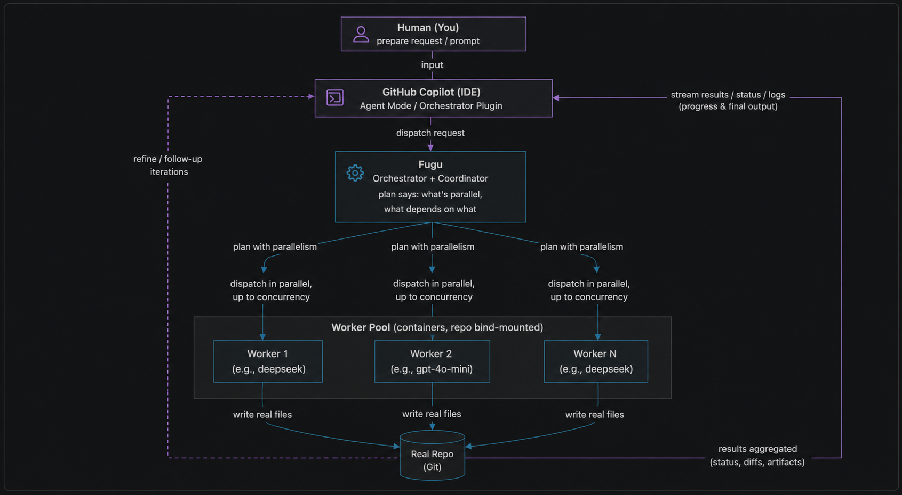

# agent-pipeline

A deterministic, config-driven multi-agent delivery pipeline. Zero runtime
dependencies (pure `node:*` + global `fetch`).

Roles mirror a real software team:

- **Client** (you / Copilot) — intake, QA, approval. Talks only to the orchestrator.
- **Orchestrator** (Fugu) — decomposes a request into bounded subtasks.
- **Workers** (deepseek-4-flash, deepseek-4-pro, gpt-5.4-mini, gpt-4o-mini) —
  build, critique, repair, or handle utility work in isolated task
  branches/worktrees, then submit PR-like changes back to Fugu.

Fugu validates worker PRs and sends rejected work back to the workers. Once Fugu
is satisfied, the accepted candidate returns to the client for final approval.
Only client-approved work is integrated.

> New here? Read [GUIDE.md](./GUIDE.md) for the full concept + a FAQ.



The diagram shows runtime coordination only: Copilot, Fugu, worker containers,
worktrees, validation, QA, and approval. Merge, deployment, and npm release
governance are intentionally separate.

## Layout

```
run.mjs                         # the engine (repo-agnostic)
pipeline.config.schema.json     # validates generated configs (used by `doctor`)
templates/                      # scaffolds written by `init`
examples/                       # demo task specs for smoke-testing installs
Dockerfile                      # runner image for containerized orchestration/workers
.github/skills/                 # reusable Copilot installer skill
README.md / GUIDE.md            # public install and concept docs
img/                            # public README assets
```

Those are the files needed to **ship and run Agent Pipeline**. They are the only
project files listed in `package.json#files`, so they are the only repo files that
enter the npm tarball.

Files with a `dev-` prefix, such as `dev-agent-context/` and
`dev-publication/`, are different: they are useful for **developing this repo and
tracking experiments**, but they are not required to install or run Agent
Pipeline. Keep `dev-*` folders on development branches and out of `release/npm`
unless explicitly needed for release documentation.

## Commands

```sh
node tools/agent-runner/run.mjs init         # scaffold config + agent mode (idempotent)
node tools/agent-runner/run.mjs doctor       # preflight: node version, config, keys, QA cmds
node tools/agent-runner/run.mjs plan --task dev-agent-tasks/<f>.md   # dry-run decomposition
node tools/agent-runner/run.mjs build --plan <plan.json> --subtask <id>  # one subtask
node tools/agent-runner/run.mjs qa           # run the repo's QA commands
node tools/agent-runner/run.mjs run --task dev-agent-tasks/<f>.md    # full loop plan→worker branches→Fugu validation→client approval
node tools/agent-runner/run.mjs report [--run <run_id>]          # aggregate telemetry
```

## Parallel execution (containers)

Fugu owns coordination: its plan declares `dependsOn` per sub-task, and the wiring
runs everything with no unmet dependency **in parallel**, up to `loop.concurrency`.
With `container.enabled` in the config, Fugu orchestration runs in the runner
container and each build sub-task runs in its **own ephemeral Docker container**
(repo bind-mounted, keys from the mounted `.env`). Two sub-tasks that touch the
same file are never run at the same time.

Docker is required for this default containerized mode. Install Docker Desktop on
macOS/Windows or Docker Engine on Linux, and confirm `docker version` works before
running containerized workers.

```sh
docker compose --profile agents build agent-worker   # build the worker image (or the wiring builds it on demand)
```

Set `container.enabled: false` to fall back to in-process execution (still
parallel, governed by `loop.concurrency`). Set `container.orchestrator: false` or
`container.workers: false` to opt only one side out of containers.

When a run appears serial, check the runner's graph line before blaming Docker:
it prints the configured concurrency, how many build sub-tasks are initially
ready, how many dependency edges Fugu planned, and how many file-overlap pairs the
safety lock found. If `initially-ready=1` or most tasks share files, the plan is
serial even though container mode is enabled.

## Faster delivery roster

The default scaffold starts from the tested faster-delivery blend:

- `deepseek-v4-flash` — primary low-cost implementer for bounded product slices.
- `gpt-5.4-mini` — QA/spec critic for acceptance criteria, tests, and edge-case review.
- `deepseek-v4-pro` — repair and integration hardener after QA failure or high-risk changes.
- `gpt-4o-mini` — utility worker for i18n, sentiment/classification, and small transformations.

Fugu remains the supervisor/orchestrator. It owns planning, dependency graphs,
worker assignment, and validation. The client still runs the real QA and approves
the final candidate. Gemini and GLM are intentionally not in the active scaffolded
roster; add them back only as explicit local experiments after recording telemetry.

The package also includes a static-game smoke task at
`examples/flatbird-demo-task.md`. After installing into a demo repo, copy that
task into `dev-agent-tasks/` and run the pipeline to validate the roster on a
small but non-trivial browser game.

## Workflow guardrails and triggers

The default roster is stable; tune delivery quality with `workflow` policy in
`pipeline.config.json` before changing models. The runner injects these rules into
Fugu's planning prompt and each worker prompt:

- `planningRules` constrain how Fugu splits work, assigns QA/spec critic tasks,
  and decides when repair or hardening is warranted.
- `buildRules` constrain worker output, grounding, checker edits, and rewrite
  scope.
- `eventTriggers` name the concrete events that should activate QA critic,
  repair hardener, or utility work.
- `groundingFiles` add repo-local context such as architecture decisions, model
  guardrails, and review checklists when those files exist.

Use this layer for cost and quality control: make GPT QA refine existing checks,
make Pro conditional on red QA or explicit integration risk, and ground every
subtask in real files and configured QA commands.

## Branch/worktree acceptance flow

The intended product workflow is branch-based, not shared-checkout editing:

1. Fugu plans the work and assigns bounded subtasks.
2. Each worker builds in its own task branch/worktree and produces a PR-like unit.
3. Fugu validates worker PRs against the plan and acceptance criteria.
4. Rejected PRs go back to the worker with Fugu's feedback.
5. Fugu returns only satisfied candidates to the client.
6. The client approves or rejects the candidate.
7. Approved work is merged into the active integration branch.

The file-overlap lock remains a wiring safety net, but it is no longer the primary
coordination model. Conflicts should appear at the PR/merge boundary where Fugu
can reject or re-plan them.

## NPM release branch

Implementation acceptance and NPM publishing are separate gates. Accepted work can
accumulate on the integration branch without being published immediately. Prepare
package releases from an explicit `release/npm` branch, run packaging checks there
(`npm pack`, install smoke test, metadata/version review), get client approval,
then publish and tag the release.

Development context in this source repo uses a `dev-` prefix, for example
`dev-agent-context/` and `dev-publication/`. Keep `dev-*` folders off
`release/npm` unless the release explicitly needs a public-facing note. They are
also excluded from the npm tarball by the package `files` whitelist.

## Install into a repo

Prerequisites:

- Node.js 20 or newer.
- Docker, for the default ephemeral-container orchestrator and worker model. Install Docker
  Desktop on macOS/Windows or Docker Engine on Linux, then make sure
  `docker version` works from your shell.
- Provider API keys for Fugu / Sakana AI, DeepSeek, and OpenAI.

The normal install path is npm/npx from the target repository:

```sh
cd /path/to/target-repo
npx @hartou/agent-pipeline init --target . --skill
```

The `--skill` flag is explicit for readability; the npm bootstrap installs the
Copilot skill by default. Use `--skip-skill` only if you want the runner without
the reusable installer skill.

The bootstrap installs:

- `tools/agent-runner/` with the pinned runner, templates, and examples.
- `.github/skills/agent-orchestrator-installer/` for future Copilot-assisted installs.
- `.github/agents/orchestrator.agent.md`.
- `.github/instructions/agent-pipeline.instructions.md` with pipeline-specific
  Copilot guidance that does not overwrite existing repo instructions.
- `.github/copilot-instructions.md` if the repo does not already have one.
- `AGENTS.md` if the repo does not already have one.
- starter `dev-agent-context/`, `dev-agent-tasks/`, and `dev-agent-output/` folders.
- `.env.agent-pipeline.example` with env var names only.

Existing files are skipped by default, so brownfield installs stay conservative.
The installer still adds the separate
`.github/instructions/agent-pipeline.instructions.md` companion file so Copilot can
discover the pipeline workflow even when `.github/copilot-instructions.md` or
`AGENTS.md` already belongs to the repo.

To apply a newer agent-pipeline version to an already-installed brownfield repo,
use `--upgrade` instead of deleting and reinstalling:

```sh
npx @hartou/agent-pipeline init --target . --upgrade --skill
```

`--upgrade` refreshes pipeline-owned assets: `tools/agent-runner/`, the installer
skill, `.github/agents/orchestrator.agent.md`, and
`.github/instructions/agent-pipeline.instructions.md`. It preserves the target
repo's customized `tools/agent-runner/pipeline.config.json`, `AGENTS.md`, and
`.github/copilot-instructions.md`. Use `--force` only when you intentionally want
to replace generated init templates, including config.

When upgrading an older generated config, the installer adds the default
`workflow` policy if the target config does not already define one. Existing
workflow policy is left untouched.
It also adds any missing default worker entries by worker key so brownfield repos
receive newly scaffolded roster roles without overwriting their existing worker
configuration.

After install, edit `tools/agent-runner/pipeline.config.json` for the target repo,
add real API keys to `.env` or your shell, and run:

```sh
node tools/agent-runner/run.mjs doctor
```

For a fast demo after doctor is green:

```sh
mkdir -p dev-agent-tasks
cp tools/agent-runner/examples/flatbird-demo-task.md dev-agent-tasks/flatbird-demo.md
node tools/agent-runner/run.mjs run --task dev-agent-tasks/flatbird-demo.md
```

Nothing about endpoints, models, or keys lives in code — only in
`pipeline.config.json`, and keys are referenced by env-var **name** only. The
engine is the same bytes in every repo; the config is the only variable.

## Fallback/dev install

1. Copy the `tools/agent-runner/` folder into the target repo (vendored — pinned
   by content, offline, no install step).
2. `node tools/agent-runner/run.mjs init` — writes `pipeline.config.json`, the
  orchestrator agent mode, and the pipeline companion instruction from
  `templates/`. Never overwrites without `--force`; use installer `--upgrade` to
  refresh pipeline-owned files while preserving config.
3. Edit `pipeline.config.json`: set `project`, `paths`, `stackFacts`, and the `qa`
   commands for this repo. Add the referenced keys to `.env`.
4. `node tools/agent-runner/run.mjs doctor` until green, then `run`.

## Installer skill

This repo also ships a reusable Copilot skill at
`.github/skills/agent-orchestrator-installer/`. Install that skill into another
repo when you want the agent to bootstrap Orchestrator mode for you. The bundled
script vendors `tools/agent-runner/`, runs `init`, creates starter
`dev-agent-context/`, `dev-agent-tasks/`, and `dev-agent-output/` folders, and writes an env
example with key names only. The starter context is indexed by
`dev-agent-context/context-index.md`; read that file first, then the context files it
references, including `new-conversation-handoff.md` for session handoff. The
npm/npx bootstrap uses this same installer under the hood.

There are two normal ways to use it.

First, make sure the target repo already exists. For a brand-new empty repo:

```sh
mkdir -p /path/to/target-repo
cd /path/to/target-repo
git init
```

### Fastest path from this repo

Clone this repo somewhere temporary, then run the installer directly against your
target repo. This does **not** require installing the skill into the target first:


```sh
gh repo clone hartou/agent-pipeline /tmp/agent-pipeline
cd /tmp/agent-pipeline
node .github/skills/agent-orchestrator-installer/scripts/install-agent-orchestrator.mjs --target /path/to/target-repo --source "$PWD"
```

### Skill-installed path

If you want the target repo to carry the reusable skill, copy only the skill first,
then run it from inside the target repo. In this mode you omit `--source`; the
script fetches `hartou/agent-pipeline` itself, then installs the runner and runs
`init`.

```sh
gh repo clone hartou/agent-pipeline /tmp/agent-pipeline
mkdir -p /path/to/target-repo/.github/skills
cp -R /tmp/agent-pipeline/.github/skills/agent-orchestrator-installer /path/to/target-repo/.github/skills/
cd /path/to/target-repo
node .github/skills/agent-orchestrator-installer/scripts/install-agent-orchestrator.mjs --target /path/to/target-repo
```

After either path, edit `tools/agent-runner/pipeline.config.json` for the target
repo, add real API keys to `.env` or your shell, and run:

```sh
node tools/agent-runner/run.mjs doctor
```

## Secrets

Keys are read from `.env` at the repo root at call time. They are never stored in
config, never printed, and never sent to the browser.

Create provider keys here, then put only the values in your local `.env`:

- Fugu / Sakana AI: https://platform.sakana.ai/
- DeepSeek: https://platform.deepseek.com/api_keys
- OpenAI: https://platform.openai.com/api-keys

The default env var names are listed in `.env.agent-pipeline.example`:

```sh
SAKANA_FUGU_API_KEY=
DEEPSEEK_API_KEY=
OPENAI_API_KEY=
```

## Telemetry (two-tier)

- **`telemetry.csv`** (auto) — one machine-written row per model call:
  `ts_iso, engine_version, run_id, round, verb, actor, role, provider, model,
  prompt_tokens, completion_tokens, total_tokens, latency_ms, http_status,
  result, qa_passed, qa_failed, files_written, est_cost_usd, task_file, error`.
- **`file-authorship.csv`** (auto) — one machine-written row per worker-written
  file: path, created/updated action, subtask id, actor key, provider, model, and
  engine version. This keeps agent authorship in metadata instead of injecting
  comments into product files.
- **`model-worker-performance.csv`** (curated) — the hand-owned acceptance ledger.
  `report` only *drafts* a row; you annotate and keep it.

`est_cost_usd` is computed from each actor's `pricing` in config (blank if pricing
is 0/unset — never fabricated). `engine_version` (from this package's `version`)
is stamped on every row so any result is traceable to the engine that produced it.

Use telemetry after real runs like this:

```sh
node tools/agent-runner/run.mjs report
```

Keep `dev-agent-context/telemetry.csv` and `dev-agent-context/file-authorship.csv` as raw
machine logs, then annotate `dev-agent-context/model-worker-performance.csv` with
human judgment: which worker was best for which task shape, what failed, what
prompt/config adjustment helped, and whether QA passed. Do not paste secrets, raw
`.env` contents, or sensitive customer data into the curated ledger.

## Contributing back from installed repos

Installed repos receive a vendored copy of the runner and skill. That means they
can experiment locally, but they cannot open a PR directly from the target repo's
normal branch because its git history belongs to that product repo, not to
`hartou/agent-pipeline`.

The safe contribution path is:

1. In the target repo, make and validate changes only under copied pipeline files:
  `tools/agent-runner/`, `.github/skills/agent-orchestrator-installer/`,
  `.github/agents/orchestrator.agent.md`, templates, or docs.
2. Open or clone `https://github.com/hartou/agent-pipeline` separately.
3. Port the same changes into that checkout, or create a patch from the target
  repo and apply it to the upstream checkout.
4. Run the package checks from the upstream checkout:

```sh
node --check run.mjs
node --check .github/skills/agent-orchestrator-installer/scripts/install-agent-orchestrator.mjs
npm pack --dry-run
```

5. Open a GitHub PR against `hartou/agent-pipeline`. Include the relevant
  telemetry summary and validation output, but redact secrets and private product
  details.

For lighter feedback, open an issue with the engine version, provider/model, task
shape, QA result, and any sanitized telemetry insight. The `engine_version` column
exists specifically so downstream results can be tied back to the package version
that produced them.
